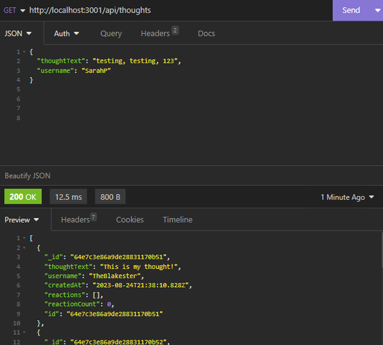

# Social Network API

## Description

In this project, I worked to create the backend of a social network with NoSQL. I was motivated to provide the ability for a social network to use a NoSQL database so that the website could handle large amounts of unstructured data.

This backend program was created so that the server would be synced to the MongoDB database with Mongoose models. Using insomnia to show the functionality, I can open the api GET routes for users and thoughts, then the data for each of the routes is displayed in a JSON format. I am also able to create, update, and delete users and thoughts in the database. From here I can test out the POST and DELETE routes in insomnia to create and delete reactions to thoughts and add and remove friends to a user’s friend list.

[Here is a link to the walkthrough video]()!

---
---

## Table of Contents

- [Usage](#usage)
- [Credits](#credits)
- [License](#license)

---
---

## Usage

This project is only the backend of a fictional social media website, so I used screenshots within insomnia to illustrate the usage.

### GET all users

### POST a new user

### GET a single user by its _id

### PUT to update a user by its _id

### DELETE to remove user by its _id

### POST to add a new friend to a user's friend list

### DELETE to remove a friend from a user’s friend list

### GET to get all thoughts

### POST to create a new thought

### GET to get a single thought by its _id

### PUT to update a thought by its _id

### DELETE to remove a thought by its _id

### POST to create a reaction stored in a single thought's reactions array field

### DELETE to pull and remove a reaction by the reaction's reactionId value

---

## Credits

Helpful Resources:
W3 School’s information about JavaScript: https://www.w3schools.com/js/default.asp
Stack Overflow’s answered questions about JavaScript: https://stackoverflow.com/
MDN’s information on JavaScript: https://developer.mozilla.org/en-US/
Google.com helping me find the above resources
The Bootcamp gitLab DU-VIRT-FSF-PT-04-2023-U-LOLC repository

The README template I used was provided by The Full-Stack Blog: https://coding-boot-camp.github.io/full-stack/github/professional-readme-guide

---

## License
MIT Licence